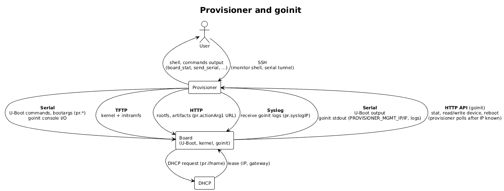

# Provisioner

## Overview

**Provisioner** is a developer-focused provisioning sidekick for single-board computers (SBCs), particularly U-Boot-based platforms.



It provides a self-contained environment to:

-   Remotely access boards
-   Automate bring-up workflows
-   Provision kernels and root filesystems
-   Execute flashing operations
-   Share lab hardware safely

The operational model is intentionally simple:

> **One board => One provisioner instance**

Provisioner runs close to the hardware and exposes controlled remote access to developers through a secure, multiplexed interface.

## System Components

The project is composed of two primary elements:

| Component   | Runs on         | Role                                                 |
|-------------|-----------------|------------------------------------------------------|
| Provisioner | Host / lab node | Control plane, serial gateway, provisioning services |
| goinit      | Target board    | Flashing agent & provisioning runtime                |

Provisioner orchestrates workflows; goinit executes them locally on the board.

## Architecture Overview

Provisioner bridges three operational planes:

1.  **User Access Plane**: SSH monitor & tunnels
2.  **Provisioning Plane**: TFTP & HTTP artifact delivery
3.  **Board Control Plane**: Serial console & goinit APIs

This allows continuous control from bootloader to runtime provisioning.

## Core Subsystems

### Serial Engine

Owns the physical console connection and provides:

-   Console multiplexing
-   Interactive monitor
-   Script automation
-   File transfer
-   Logging

Serial remains the ultimate fallback control path.

### Provisioning Services

Embedded services provide boot artifacts:

**TFTP**

-   Kernel delivery
-   HTTP proxy fetch via encoded filenames

**HTTP**

-   Rootfs images
-   Device trees
-   Kernel artifacts
-   Generic binaries

### Control Plane via SSH

Provisioner exposes a unified SSH endpoint acting as both access and control layer.

All remote interactions are **multiplexed over a single SSH connection** and governed via public key authentication.

Multiplexed channels include:

-   Monitor shell
-   Serial console tunnels
-   Control CLI
-   File transfers

Access governance:

-   Public key identity
-   Tunnel enable/disable per user
-   Centralized permission enforcement

SSH therefore carries both:

-   **Management plane traffic**
-   **Serial data plane streams**

----------

## Internal Router

At the heart of Provisioner's I/O model sits the **router**, a pluggable software artifact that brokers terminal streams between producers and consumers.

All console traffic flows through this component rather than directly between subsystems.

### Producer / Consumer Model

Router clients may:

-   Produce terminal data
-   Consume terminal data
-   Operate bidirectionally

Examples:

-   SSH monitor sessions
-   Serial tunnels
-   Automation scripts
-   Logging agents
-   Transfer utilities

### Human vs Machine Clients

The router distinguishes between two client variants:

| Type    | Characteristics         | Examples            |
|---------|-------------------------|---------------------|
| Human   | Interactive, ANSI-aware | SSH terminals       |
| Machine | Deterministic, raw I/O  | Scripts, automation |

This allows tailored stream handling for usability vs determinism.

### Routing Strategies

**Unicast**

-   Single recipient
-   Used for exclusive control sessions or transfers

**Multicast**

-   Broadcast delivery
-   Used for monitoring, logging, observers

Multiple engineers can watch the same console without interference.

### ANSI Watcher

A dedicated pluggable watcher mitigates ANSI terminal nuances:

-   Observes control sequences
-   Normalizes rendering artifacts
-   Prevents automation breakage

Implemented as a plugin rather than hardcoded logic.

## Monitor CLI

The monitor shell provides interactive board control.
```
> ?  
 ? : this text  
 board_stat : report last goinit board stat; board must have printed PROVISIONER_MGMT_*  
 echo : echoes back the argument  
 enuser : enable user for tunnel  
 exec_assm : Load and executes the specified assm script  
 exec_scr : Load and executes the specified script  
 exec_state : returns the state of the specified script  
 exit : exit this shell  
 filter : Filter commands: type 'filter help' for more info  
 help : this text  
 log_serial : copies in a file ser.log all sent and received from the serial. Note: overwrites previous.  
 log_serial_stop : Requires serila log subsystem to stop.  
 send_serial : send file over serial: send_serial <file> <plain|gzip|xmodem_unix|xmodem_uboot> [dest_path]  
 send_serial_deps : check remote deps for send_serial plain/gzip: stty, dd, base64, gzip, rm (or busybox).  
 toff : command PDU using snmp to turn off the board  
 ton : command PDU using snmp to turn on the board  
 tterm : terminate serial tunnel connection  
 ulist : list user state for tunnel  
>
```
### Filter Subsystem
```
filter help
available: enable, disable, default, show, add, remove, help
```
Rules may be defined in ASCII or HEX:
```
filter add ascii Hello Hello World 
filter add hex 48656c6c6f 48656c6c6f 576f726c64
```

Filters can:

-   Intercept received data
-   Forward or suppress streams
-   Inject responses

This is useful for boot automation and console normalization.

## Serial File Transfer

Provisioner supports direct serial file transfer:
```
send_serial <file> <mode> [dest_path]
```

Modes:
| Mode         | Method               |
|--------------|----------------------|
| plain        | Base64               |
| gzip         | Base64 + compression |
| xmodem_unix  | XMODEM via `rx`      |
| xmodem_uboot | XMODEM via `loadx`   |

Dependencies checked via:
```
send_serial_deps
```

Required utilities:

-   stty
-   dd
-   base64
-   gzip
-   rm / busybox

### send_console-ng Integration

The transfer engine derives from the standalone utility [send_console-ng](https://github.com/alessandrocarminati/send_file-ng), adapted into Provisioner.
It enables file transfer when:

-   No network exists
-   Only a shell prompt is available
-   Recovery tooling must be pushed manually

Capabilities:

-   Remote terminal configuration
-   Compression & encoding
-   Buffered streaming
-   Dependency probing

Compared to the original utility:

-   `stdbuf` and `cat` dependencies removed
-   `dd` introduced for portability
-   XMODEM support added where receivers exist

This allows Provisioner to operate even in severely degraded board states.

## Automation & Scripting

### assm: Native Scripts

Assembly-like expect engine:

-   Prompt matching
-   Deterministic responses
-   Byte-oriented execution

Best suited for login and boot flows.

### exec_scr: External Scripts

Executes external programs bound to the serial stream.

Modes:
| Mode | Behavior      |
|------|---------------|
| line | Line-buffered |
| char | Byte-stream   |

## Optional Integrations

### Google Calendar (Optional)

Lightweight reservation integration exists but is not a primary project focus.
Used only for:

-   Time-based access
-   Shared lab booking

Provisioner does not aim to become a full lab scheduler.

## Build & Portability

Provisioner is written in Go and cross-compiles easily.

### Native build
```
make
``` 

### Cross-compile examples

```
GOARCH=arm64 make
```

No external toolchains required.

Deployable on:

-   Servers
-   Edge hosts
-   Raspberry Pi class systems
-   Lab gateways
