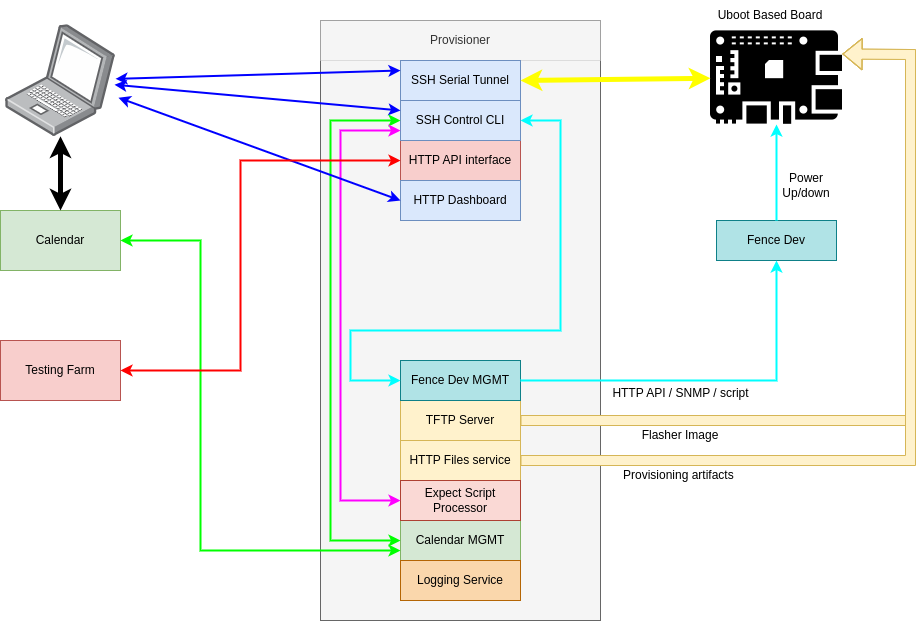

# Provisioner Project

## Description
The Provisioner project aims to develop a comprehensive provisioning sharing
application for common u-boot based boards.
This application is designed to be self-contained, providing a seamless
experience for efficiently managing and provisioning resources.

Key functionalities of the final tool are outlined below:

## Serial Connection Management:
The application takes ownership of the serial connection to the serial 
console of the board and extends access externally through SSH.

## Control Plane via SSH:
A control plane accessible through SSH is implemented, serving as a CLI for
board management. Additionally, it facilitates various utilities, including
power management controls for the board.

## TFTP Service for Kernel Image Provisioning:
Incorporates a TFTP service within the application to facilitate efficient
provisioning of kernel images. This service ensures seamless transfer and
deployment of kernel images to the respective boards.

## HTTP Service for Binary Artifact Provisioning:
Integration of a per-user HTTP service dedicated to serving binary artifacts
such as root file system (rootfs) images, kernel images, and device trees.
This service enhances accessibility and facilitates the distribution of
essential resources required for board provisioning.

## Integration with Google Calendar:
Implementation of integration with Google Calendar to enable access control
and reservations. This functionality ensures efficient resource allocation
and scheduling, enhancing the overall management of board provisioning
processes.

## Kernel Image:
Crafts a kernel image that embeds the initram equipped with scripts capable
of flashing a new kernel image and/or rootfs image, driven by kernel
arguments.

The successful implementation of these features will result in a robust
provisioning sharing application tailored specifically for common u-boot
based boards.
This tool will streamline provisioning processes, enhance accessibility,
and improve overall management efficiency.

## Additional Information:
The final product is meant to interact with the board using expect-based
scripts and a companion application acting as an init Linux prepared to
act as a flasher agent within the board.
